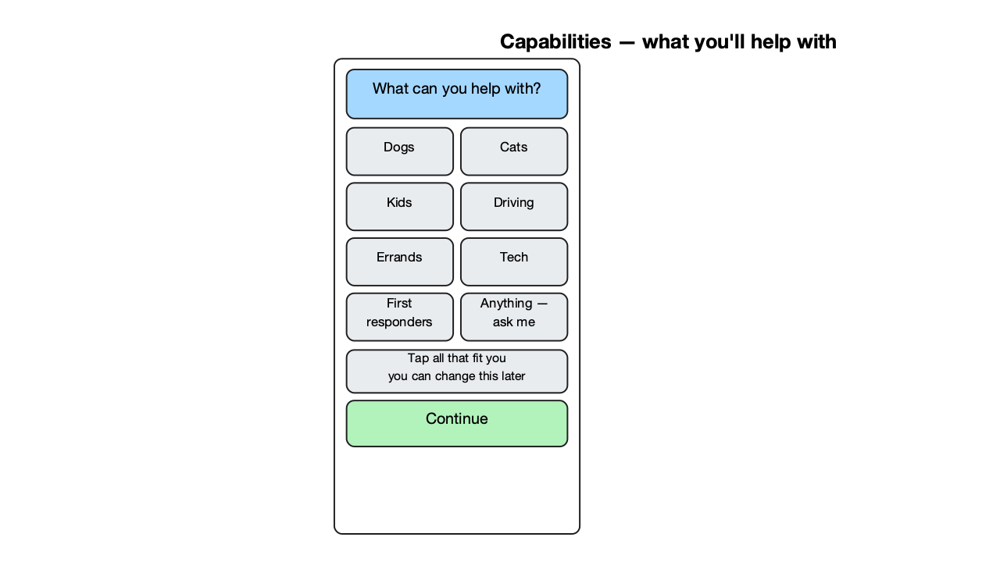
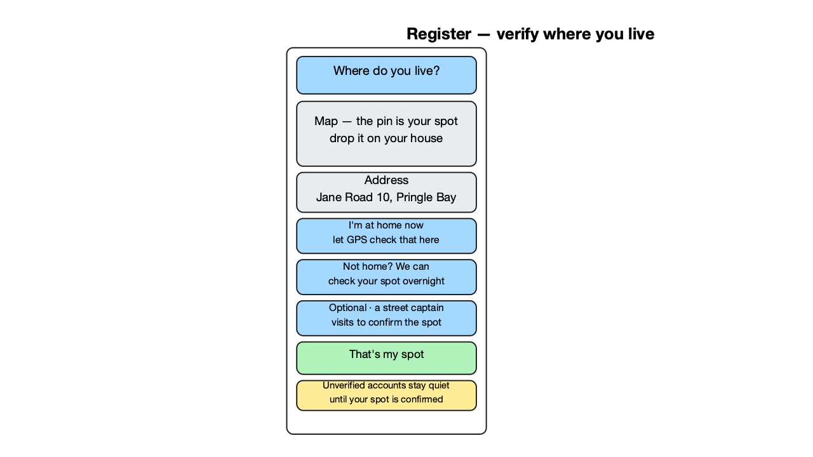
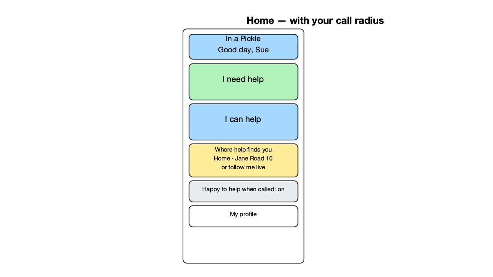
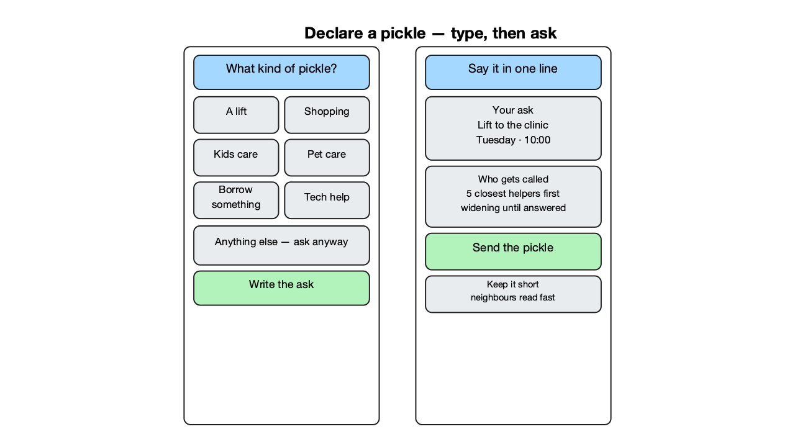
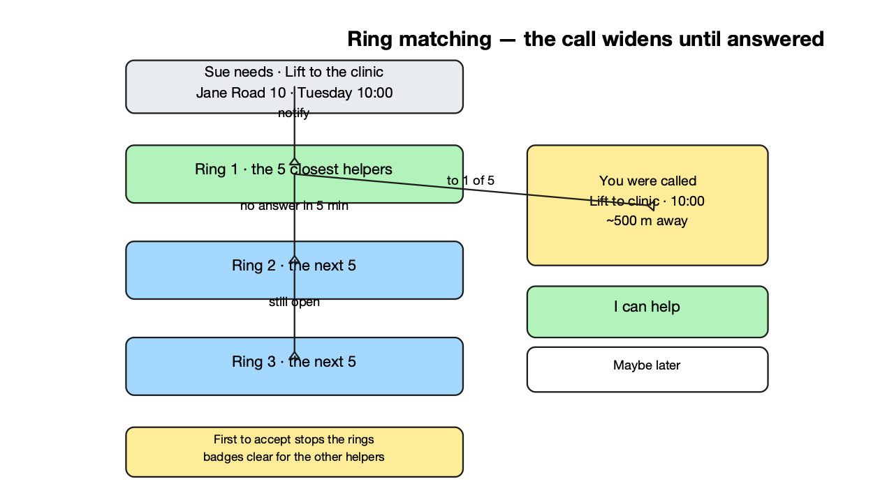
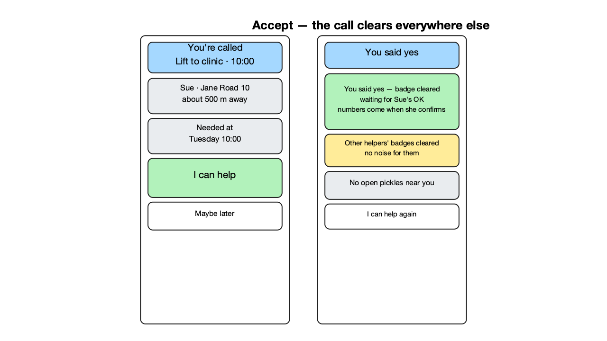

# In a Pickle — screen design (round 2)

For the record that started this: a Pringle Bay first-responders volunteer asked for a
village app — realistically 200–1,000 users, a marketing occasion and a community
stitch-together if handled gently. The prose below is the *why*; the wireframes are
the *what*. All scenes are native `.excalidraw` files next to these 720p renders, made
in the "someone drew this by hand quickly" style: nested coloured squares with black
borders, default stroke weights, at most a few short lines per block.

Review status: **APPROVED** by the adversarial design reviewer after two rounds
(round 1 REJECTED with 10 findings, all resolved; round 2 APPROVED with four
documented minors). The legibility gate passes every scene with zero blockers
(glyphs ≥ 14 px at ~1.0 fit-to-720p, no overlaps or spills). A by-eye pass with a
vision-capable model or a human is the last confirmation, since the gate is geometric.

## What the app is for

Two jobs, one circle:

- **Ask.** "I need a lift to the clinic on Tuesday at 10." — a structured, one-line ask.
- **Offer.** "I have first-aid training; I'll watch kids or dogs; ask me anything."

Matching sends the ask to the few people closest *and* most likely to say yes first,
and the moment someone says yes the whole call clears elsewhere. No noise, no
scrolling jungle, no "I missed it" guilt for anyone.

## Registering: capability questions first

The brief says registration is "five to ten questions" deciding what a person will
help with. That comes first — it is lightweight, confidence-free, and it teaches the
app what this neighbour actually offers before any trust machinery shows its face.

- Tiles read as plain offers: Dogs, Cats, Kids, Driving, Errands, Tech, and the
  harder questions (first-responder training) get their own tile.
- A deliberate **catch-all — "Anything — ask me"** is the safety net the brief asked
  for: blessedly vague, always present.
- One green action per screen; everything else neutral so colour never carries the
  meaning alone.

## Registering: where you live (verification)

Everybody registers at their real spot — "I'm Sue from Jane Road 10" — and an
unverified account stays quiet. The brief allows two verification modes and one
optional social layer; all three are drawn.

1. **GPS now ("I'm at home now")** — the pin lands from their tap; the phone checks the
   claimed address against where it actually is, at that moment.
2. **Overnight pattern** — GPS at registration is the happy path; a neighbour who
   cannot do it that second still verifies later by silent overnight tracking. Same
   outcome: "your spot is confirmed".
3. **Street captain (optional layer)** — the village's volunteer who would gladly
   drive over, say hello, and confirm a dot on a map. This is a *layer we may switch
   on and off*, never the only door. Unverified simply means quiet for everyone's sake.

One design decision to note: only one primary action sits on the screen (the green
"That's my spot"); the three verification options are all secondary choices.

## Home: the call radius is the holder's choice

The brief: "we may match by address *or* current location — the user being called
on decides." Home makes it visible.

- Two giant verbs, same as phase one: **I need help / I can help**.
- **Where help finds you** — *Home · Jane Road 10* or *follow me live*. This is the
  switch that decides whether ring matching uses the address (most people) or
  background location (people out and about who want to be called on the go).

## Declaring a pickle: structured, then one line

- Type first, one tap: A lift, Shopping, Kids care, Pet care, Borrow something, Tech
  help — and the catch-all *Anything else — ask anyway*, because life is longer than
  our taxonomy.
- Then one plain line and a who-gets-called promise: *5 closest helpers first,
  widening until answered.* A short ask, because neighbours read fast.
- Green is reserved for the one action that closes the deal: **Send the pickle**.

## Ring matching: widen only when silence answers

- A pickle is offered to the **5 closest** willing people first (by address or live
  location, per the Home screen choice).
- Silence for a few minutes widens the call to the **next 5**, then the **next 5**.
  The caller never broadcasts to the whole village at once.
- The called side sees one card — *you were called* — with the bare truth (who, what,
  how far) and two choices.

## Accept: the call clears everywhere else

The brief's quiet-economy rule: the instant someone accepts, the badge is gone for
everyone else. No log trace, no "someone else got it" noise.

- Left, the responder: *You said yes*. That is the trigger — no double-confirmation
  theatre for the helper.
- Two documented decisions (both sanctioned minors from the review):
  - The responder sees *"waiting for Sue's OK — numbers come when she confirms."*
    Acceptance clears the *other helpers'* badges immediately; the **requester's OK
    gates only contact details**, so nobody is surprised by a stranger phoning them.
    This is the privacy seam in the earlier brief ("you approve a match before a
    helper can contact you") and the badge-clear behaviour match each other here.
  - Info density is intentionally lower for people far away (just distance) and full
    for the responder (name + street) — distance needn't leak Jane Road 10 to ten
    strangers's phone screens before a yes.

## Standing decisions worth keeping

- **Order:** capabilities → where you live → home. (Reviewer correction: the earlier
  draft implied steps in reverse.)
- **One primary action per screen**, green; secondary blue; state-yellow only for
  "worth noticing, not urgent"; red saved for real warnings on later screens.
- **Catch-all everywhere**: one per register profile *and* one per pickle type; the
  taxonomy is deliberately unfinished.
- **Verify then trust**: unverified accounts are quiet; the street-captain layer is a
  switchable extra, GPS + overnight are the always-on paths.

## Files

- Scenes: `docs/design/design-0{1..6}-*.excalidraw` (editable, canonical).
- Renders: the `*.png` beside them (720p, generated by the exccalidraw skill's
  `render_scene.py`).
- Generator: `tool/gen_wireframes.py` re-produces every scene; hand-edits belong in
  the `.excalidraw` files, not the generator.