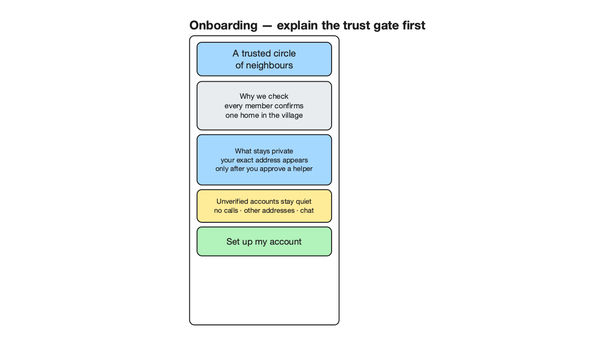
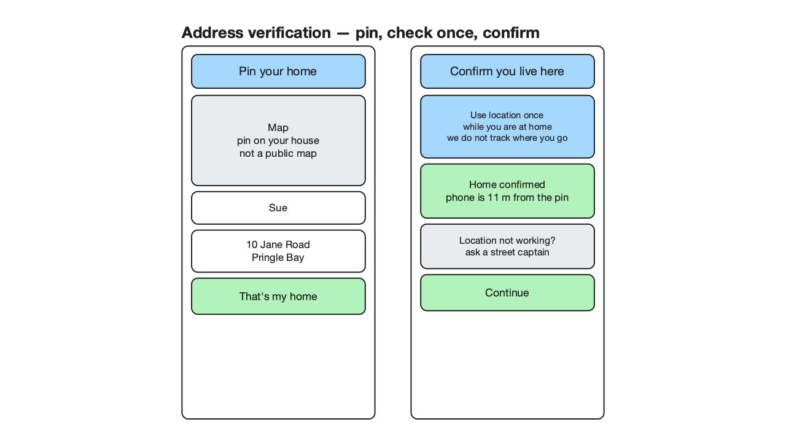
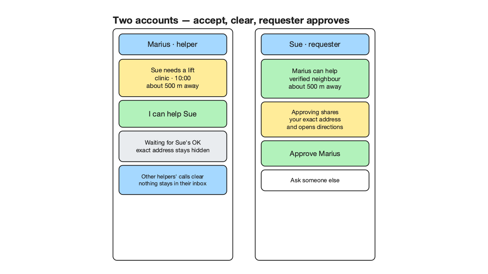
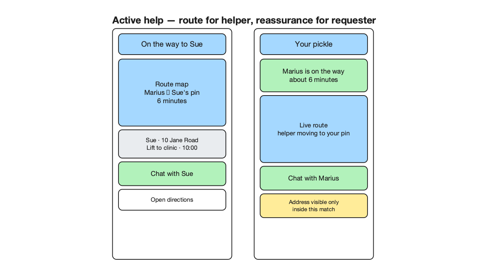
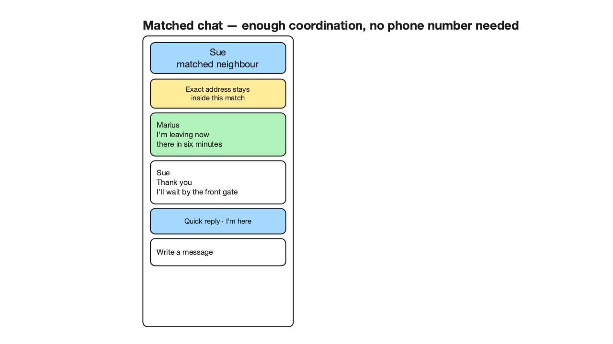

# In a Pickle — screen design (round 2)

For the record that started this: a Pringle Bay first-responders volunteer asked for a
village app — realistically 200–1,000 users, a marketing occasion and a community
stitch-together if handled gently. The prose below is the *why*; the wireframes are
the *what*. All scenes are native `.excalidraw` files next to these 720p renders, made
in the "someone drew this by hand quickly" style: nested coloured squares with black
borders, default stroke weights, at most a few short lines per block.

Review status: **APPROVED** by the adversarial design reviewer after two rounds
(round 1 REJECTED with 10 findings, all resolved; round 2 APPROVED with four
documented minors). The legibility gate passes every scene with zero blockers
(glyphs ≥ 14 px at ~1.0 fit-to-720p, no overlaps or spills). A by-eye pass with a
vision-capable model or a human is the last confirmation, since the gate is geometric.

Round 3 status: **APPROVED** after one rejected app-copy pass and a corrected
re-review. The review record is in [reviews/round-3-review.md](reviews/round-3-review.md).

## What the app is for

Two jobs, one circle:

- **Ask.** "I need a lift to the clinic on Tuesday at 10." — a structured, one-line ask.
- **Offer.** "I have first-aid training; I'll watch kids or dogs; ask me anything."

Matching sends the ask to the few people closest *and* most likely to say yes first,
and the moment someone says yes the whole call clears elsewhere. No noise, no
scrolling jungle, no "I missed it" guilt for anyone.

## Registering: capability questions first

The brief says registration is "five to ten questions" deciding what a person will
help with. That comes first — it is lightweight, confidence-free, and it teaches the
app what this neighbour actually offers before any trust machinery shows its face.

- Tiles read as plain offers: Dogs, Cats, Kids, Driving, Errands, Tech, and the
  harder questions (first-responder training) get their own tile.
- A deliberate **catch-all — "Anything — ask me"** is the safety net the brief asked
  for: blessedly vague, always present.
- One green action per screen; everything else neutral so colour never carries the
  meaning alone.

## Registering: where you live (verification)

Everybody registers at their real spot — "I'm Sue from Jane Road 10" — and an
unverified account stays quiet. The brief allows two verification modes and one
optional social layer; all three are drawn.

1. **GPS now ("I'm at home now")** — the pin lands from their tap; the phone checks the
   claimed address against where it actually is, at that moment.
2. **Come back later** — GPS at registration is the happy path; a neighbour who is
   not home returns and runs the same one-time check when they choose. There is no
   silent tracking in the current design.
3. **Street captain (optional layer)** — the village's volunteer who would gladly
   drive over, say hello, and confirm a dot on a map. This is a *layer we may switch
   on and off*, never the only door. Unverified simply means quiet for everyone's sake.

One design decision to note: only one primary action sits on the screen (the green
"That's my spot"); the three verification options are all secondary choices.

## Home: the call radius is the holder's choice

The brief: "we may match by address *or* current location — the user being called
on decides." Home makes it visible.

- Two giant verbs, same as phase one: **I need help / I can help**.
- **Where help finds you** — *Home · Jane Road 10* or *follow me live*. This is the
  switch that decides whether ring matching uses the address (most people) or
  background location (people out and about who want to be called on the go).

## Declaring a pickle: structured, then one line

- Type first, one tap: A lift, Shopping, Kids care, Pet care, Borrow something, Tech
  help — and the catch-all *Anything else — ask anyway*, because life is longer than
  our taxonomy.
- Then one plain line and a who-gets-called promise: *5 closest helpers first,
  widening until answered.* A short ask, because neighbours read fast.
- Green is reserved for the one action that closes the deal: **Send the pickle**.

## Ring matching: widen only when silence answers

- A pickle is offered to the **5 closest** willing people first (by address or live
  location, per the Home screen choice).
- Silence for a few minutes widens the call to the **next 5**, then the **next 5**.
  The caller never broadcasts to the whole village at once.
- The called side sees one card — *you were called* — with the bare truth (who, what,
  how far) and two choices.

## Accept: the call clears everywhere else

The brief's quiet-economy rule: the instant someone accepts, the badge is gone for
everyone else. No log trace, no "someone else got it" noise.

- Left, the responder: *You said yes*. That is the trigger — no double-confirmation
  theatre for the helper.
- Two documented decisions (both sanctioned minors from the review):
  - The responder sees *"waiting for Sue's OK — address comes when she confirms."*
    Acceptance clears the *other helpers'* badges immediately; the **requester's OK
    gates the exact address and route**. In-app messaging may start while the address
    stays hidden, so the pair can coordinate without exchanging phone numbers.
  - Info density is intentionally lower for people far away (just distance) and full
    for the responder (name + street) — distance needn't leak Jane Road 10 to ten
    strangers's phone screens before a yes.

## Standing decisions worth keeping

- **Order:** capabilities → where you live → home. (Reviewer correction: the earlier
  draft implied steps in reverse.)
- **One primary action per screen**, green; secondary blue; state-yellow only for
  "worth noticing, not urgent"; red saved for real warnings on later screens.
- **Catch-all everywhere**: one per register profile *and* one per pickle type; the
  taxonomy is deliberately unfinished.
- **Verify then trust**: unverified accounts are quiet; the street-captain layer is a
  switchable extra, and the foreground at-home check is the primary path.

## Files

- Scenes: `docs/design/design-0{1..6}-*.excalidraw` (editable, canonical).
- Renders: the `*.png` beside them (720p, generated by the exccalidraw skill's
  `render_scene.py`).
- Generator: `tool/gen_wireframes.py` re-produces every scene; hand-edits belong in
  the `.excalidraw` files, not the generator.

## Round 3 — from location setup to an active match

Round 3 turns the trust and location ideas into one coherent first-run experience,
then carries one pickle across two accounts. These scenes deliberately stay simple:
they explain state and privacy, while the Flutter screenshots exercise the actual
widgets.

### Explain the gate before asking for location

The opening promise is: this is a closed village circle; every home is confirmed;
an exact address is not public and appears only inside an accepted match. The user
hears the reason before seeing a location permission. An unverified account is
described as *quiet*, not punished or suspicious.

### Pin the home, then check once

The happy path is foreground-only: pin the address, run one location check while at
home, and report the measured result. The captain visit remains a humane fallback.
The earlier overnight-tracking idea is intentionally not in this increment: it asks
for much broader privacy and platform work than the at-home check needs, especially
for a PWA.

The Flutter prototype uses an injected deterministic verifier (11 m from the pin).
That is honest test infrastructure, not a claim that residency can already be proven
by the browser.

### One acceptance, two accounts, no lingering noise

Sue opens a pickle. The local community model chooses up to five closest verified,
available, category-matching helpers. Marius accepts; Fatima's inbox becomes empty
immediately. Marius can message Sue, but the exact address and route stay hidden until
Sue approves him. The multi-account test asserts all of those privacy transitions.

### The active route reassures both sides

After approval, Marius sees Sue's exact destination, an ETA, route, and chat action.
Sue sees the mirrored reassurance: who is coming and how far away they are. The local
map is intentionally static and tile-free, which keeps routine screenshots fast and
deterministic; a production map adapter can replace it later.

### Chat belongs to the match

The chat solves coordination without requiring neighbours to exchange phone numbers.
It exists only between the requester and accepted helper, and its privacy reminder is
part of the screen rather than buried in settings.

## Screenshot-state crank

Run `./tool/capture_app_states.sh` to replace `tmp/screenshots/latest/` with thirteen
390×844 PNGs: trust gate, address pin, verified home, incoming helper call, helper
waiting, requester approval, helper route, matched chat, requester tracking, and the
cleared third-helper inbox, plus captain fallback, capability questions, and the
finished home state. The folder is temporary and ignored by Git; the command is the
canonical way to reproduce it.

The screenshot test uses a fixed clock, people, coordinates, map painter, viewport,
font, and icons. It never launches Chrome and makes no network requests. A full crank
currently takes only a few seconds on the development machine.

## Connector regression fixed

The original generator stored arrows from box centre to box centre and relied on
bindings to repair the picture. Excalidraw bindings do not rewrite those points for a
standalone renderer. The generator now computes real rectangle-boundary ports, adds
the declared gap, uses centred focus, and makes connector dimensions match the point
extents. Labels are one newline-separated bound element per owner.

The shared Excalidraw skill now rejects missing/duplicate indices, malformed point
extents, inside-box endpoints, false declared gaps, and multiple bound labels. Its
legibility review's segment clipping and label-owner lookup were also corrected, so
arrow/text intersections and spills can no longer pass silently.
